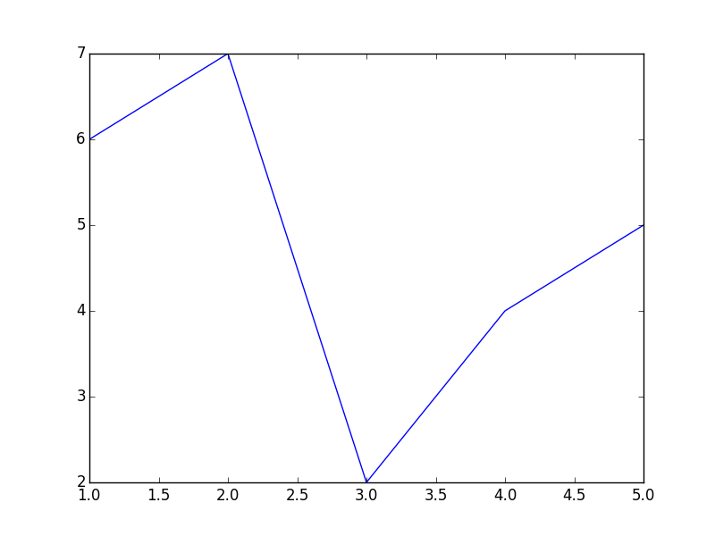

PyMarkdown
==========

Evaluate code in markdown.

Why?
----

Mostly because I was jealous of
[RMarkdown/knitr](http://rmarkdown.rstudio.com/).

The Jupyter notebook teaches us that interleaving prose, code, and results
conveys meaning well. However when we author persistent content we often want a
simple static text-based format.  Markdown is good here because it plays well
with other tools like `vi/emacs`, `pandoc`, and `git`.

RMarkdown/knitr has demonstrated value in the R ecosystem, lets mimic that.


How does this work?
-------------------

PyMarkdown leverages the `doctest` module to parse code into prose and code
segments much like a docstring.  It then executes each code segment
sequentially with Python's `exec`, tracking state throughout the document,
emitting or correcting results from computation where appropriate.  For some
outputs we use custom rendering, notably leveraging common protocols like
`__repr_html__` and special casing plotting libraries.

In simple cases both input and output documents are valid markdown appropriate
for publication on github, your favorite blogging software, or with pandoc.
For complex rendering we've specialized on emitting HTML-enhanced Markdown,
which looks great in a browser but limits cross-markup-language compatibility
(sorry LaTeX users).


Example
-------

### Input

    Our documents contain prose with *rich formatting*.

    ```Python
    # And code blocks
    >>> x = 1
    >>> x + 1

    >>> 2 + 2*x
    with potentially missing or wrong results
    ```

We run pymarkdown and looks at updated results:

    $ pymarkdown text.md text.out.md

### Output

Our documents contain prose with *rich formatting*.

```Python
# And code blocks
>>> x = 1
>>> x + 1
2

>>> 2 + 2*x
4
```

Fancy Support
-------------

    ### HTML

    PyMarkdown leverages standard protocols like `to_html` or `__repr_html__`.

    ```python
    >>> import pandas as pd
    >>> df = pd.DataFrame({'name': ['Alice', 'Bob', 'Charlie'],
    ...                    'balance': [100, 200, 300]})
    >>> df
    ```

### HTML

PyMarkdown leverages standard protocols like `to_html` or `__repr_html__`.

```python
>>> import pandas as pd
>>> df = pd.DataFrame({'name': ['Alice', 'Bob', 'Charlie'],
...                    'balance': [100, 200, 300]})
>>> df
```
<table border="1" class="dataframe">
  <thead>
    <tr style="text-align: right;">
      <th></th>
      <th>balance</th>
      <th>name</th>
    </tr>
  </thead>
  <tbody>
    <tr>
      <th>0</th>
      <td> 100</td>
      <td>   Alice</td>
    </tr>
    <tr>
      <th>1</th>
      <td> 200</td>
      <td>     Bob</td>
    </tr>
    <tr>
      <th>2</th>
      <td> 300</td>
      <td> Charlie</td>
    </tr>
  </tbody>
</table>


Images
------

    PyMarkdown supports both [Matplotlib](http://matplotlib.org/) and
    [Bokeh](http://bokeh.pydata.org/) figure objects.

    Bokeh plots only work in browser but remain interactive.  You must create a
    standalone HTML file, possibly with [Pandoc](http://johnmacfarlane.net/pandoc/)

        pandoc myfile.out.md -o myfile.html --standalone

    ```
    >>> import matplotlib.pyplot as plt

    >>> fig = plt.figure()
    >>> plt.plot([1, 2, 3, 4, 5], [6, 7, 2, 4, 5])
    >>> fig
    ```

PyMarkdown supports both [Matplotlib](http://matplotlib.org/) and
[Bokeh](http://bokeh.pydata.org/) figure objects.

Bokeh plots only work in browser but remain interactive.  You must create a
standalone HTML file, possibly with [Pandoc](http://johnmacfarlane.net/pandoc/)

    pandoc myfile.out.md -o myfile.html --standalone

```
>>> import matplotlib.pyplot as plt

>>> fig = plt.figure()
>>> plt.plot([1, 2, 3, 4, 5], [6, 7, 2, 4, 5])
[<matplotlib.lines.Line2D object at 0x7f1b53169690>]
>>> fig
```



Support
-------

There is none!  This is a single-weekend project.  Use at your own risk.
Please contribute and take this project over.

Honestly what I've learned is that this isn't that hard and that a lot of
people really want this.  If you're reading this then I encourage you to
extend or reinvent this project to make it better.


TODO
----

- [x] Interact with Bokeh plots.  These already implement `__repr_html__` so
      this probably just means linking to some static content somewhere.
- [x] Interact with matplotlib
- [ ] Support inlining of values in prose blocks
- [ ] Support options like ignore, echo=False, etc..
- [ ] Handle exceptions
- [ ] Better command line interface (should use something like `argparse` rather
      than `sys.argv`)
- [ ] Find a better name?

Open Questions
--------------

*  I specialized towards HTML because that's what I care about at the
   moment.  This might not be a good approach long term though.
*  Do we want to integrate with pandoc?  I tend to do something like the
   following

        pymarkdown myfile.md myfile.out.md  && \
        pandoc myfile.out.md -o myfile.html --standalone

    But it would be nice for this to be easier to write in one go

        pymarkdown myfile.md -o myfile.html

Have other thoughts?  Great!  Please implement them :)
